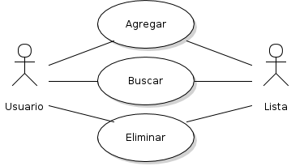

### Introducción

  Se modelará el caso de uso de Acciones de una lista de Favoritos que tiene cada usuario registrado.

### Modelo de Actores

Actor |Descripción
------|-----------
Usuario | Es un usuario registrado dentro de Setflix
Listas | Son distintas listas que el usuario puede generar

Funcion | Descripción
--------| -----------
Agregar | El usuario seleccionando la serie de su agrado tiene la opción de guardar la serie en su lista de Favoritos.
Buscar | A medida que va creciendo la lista de Favoritos, el usuario puede buscar entre todas las agregadas para luego poder recomendarla a otros.
Eliminar | Si por algún motivo el usuario decide quitar una serie de su lista lo podrá realizar, seleccionandola y quitando.
